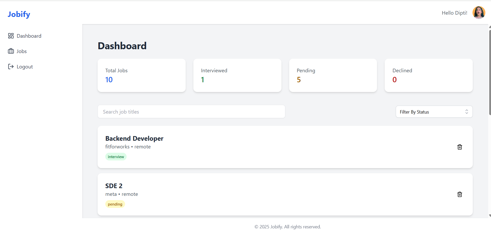
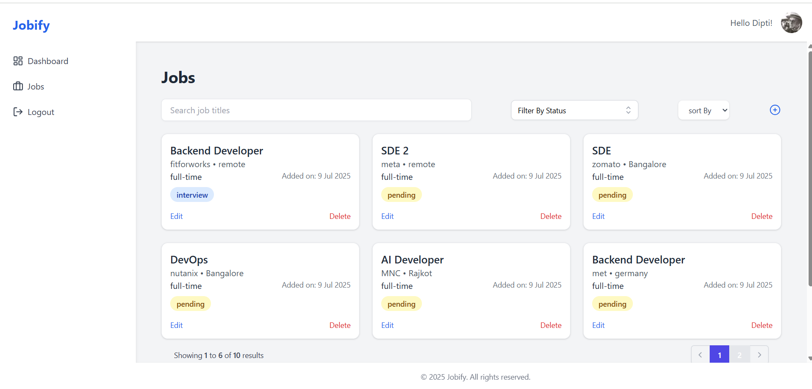

# 🚀 Jobify – Job Tracking App

Hey there! 👋  
Welcome to **Jobify**, a full-stack web app I built to help users track their job applications, interviews, and progress in one place. Think of it as your job-hunting assistant – simple, clean, and actually useful.

---

## 🌐 Live Demo

The app is deployed and fully functional:

- 🔗 **Frontend (Vercel):** [https://jobify-frontend-beta.vercel.app/login](https://jobify-frontend.vercel.app)
- 🔗 **Backend (Render):** [https://jobify-backend-963o.onrender.com](https://jobify-backend-963o.onrender.com)

> ⚠️ The backend is hosted on Render’s free tier, so the first request after inactivity might take ~50 seconds due to cold start.

---

## 🛠️ Tech Stack

**Frontend:**

- React
- Tailwind CSS
- Axios
- Headless UI
- React Toastify
- Heroicons

**Backend:**

- Node.js + Express
- MongoDB (Mongoose)
- JWT Auth with Refresh Tokens
- dotenv & Helmet for config and security

---

## 🔑 Features

### 🧑‍💼 Jobs

- Add, edit, delete jobs
- View jobs with pagination
- Sort by date, position, and type
- Search and filter by status (pending, interview, declined)

### 📊 Dashboard

- Summary cards for quick stats
- Real-time filters and search
- Pagination with result counter

### 🔐 Auth

- Register / Login
- JWT authentication with refresh tokens
- Auth-protected routes

---

## 💡 Highlights

- 🔥 Modern UI with Tailwind + Headless UI
- ⚙️ Fully connected REST API
- 💾 Stores tokens securely in cookies
- 🔎 Trie-based local search for job suggestions (autocomplete)
- ✅ Reusable form components and modals

---

## 📸 Screenshots

  
_Clean, informative dashboard with status summaries_

  
_Easily manage jobs with edit/delete options_

---

## 🧪 Future Enhancements (not yet implemented)

- Client-side form validations
- Image upload support for company logos
- Drag and drop job status updates
- Role-based user access
- Mobile responsiveness polish

---

## 🔧 Setup Instructions

```bash
# Backend Setup
cd backend
npm install
npm run dev

# Frontend Setup
cd frontend
npm install
npm run dev
```

Update your `.env` files before running.

---

## 📁 Folder Structure (Short)

```
├── backend
│   ├── controllers
│   ├── middleware
│   ├── models
│   └── routes
├── frontend
│   ├── components
│   ├── pages
│   └── utils
```

---

## 🙋‍♂️ Why I Built This

I built Jobify purely for practice purposes — to sharpen my MERN stack skills through a real-world project.  
It was a fun way to level up my skills and show that I can build clean, functional, and user-friendly full-stack apps — definitely something I’m happy to have in my portfolio.

---

## 🤝 Want to Connect?

Happy to hear feedback, suggestions or job offers 😉  
Find me on [LinkedIn](https://www.linkedin.com/in/dipti-pariya/), or feel free to [email me](mailto:diptipariya@gmail.com)!
